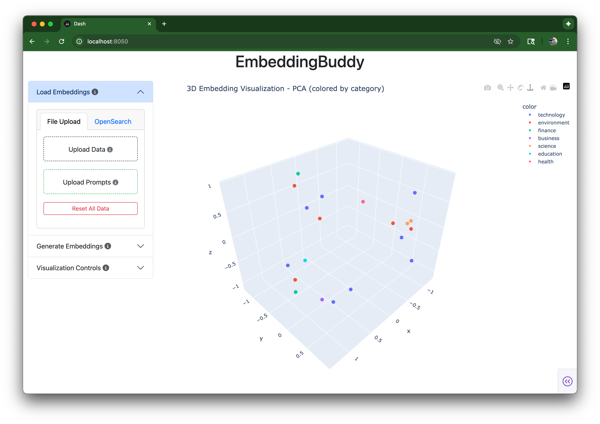

# EmbeddingBuddy

A web application for interactive exploration and visualization of embedding
vectors through dimensionality reduction techniques. Compare documents and prompts
in the same embedding space to understand semantic relationships.



## Overview

EmbeddingBuddy provides an intuitive web interface for analyzing high-dimensional
embedding vectors by applying various dimensionality reduction algorithms and
visualizing the results in interactive 2D and 3D plots. The application supports
dual dataset visualization, allowing you to compare documents and prompts to
understand how queries relate to your content.

## Features

- **Dual file upload** - separate drag-and-drop for documents and prompts
- **Multiple dimensionality reduction methods**: PCA, t-SNE, and UMAP
- **Interactive 2D/3D visualizations** with toggle between views
- **Color coding options** by category, subcategory, or tags
- **Visual distinction**: Documents appear as circles, prompts as diamonds with desaturated colors
- **Prompt visibility toggle** - show/hide prompts to reduce visual clutter
- **Point inspection** - click points to view full content and identify document vs prompt
- **Reset functionality** - clear all data to start fresh
- **Sidebar layout** with controls on left, large visualization area on right
- **Real-time visualization** optimized for small to medium datasets

## Data Format

EmbeddingBuddy accepts newline-delimited JSON (NDJSON) files for both documents
and prompts. Each line contains an embedding with the following structure:

**Documents:**

```json
{"id": "doc_001", "embedding": [0.1, -0.3, 0.7, ...], "text": "Sample text content", "category": "news", "subcategory": "politics", "tags": ["election", "politics"]}
{"id": "doc_002", "embedding": [0.2, -0.1, 0.9, ...], "text": "Another example", "category": "review", "subcategory": "product", "tags": ["tech", "gadget"]}
```

**Prompts:**

```json
{"id": "prompt_001", "embedding": [0.15, -0.28, 0.65, ...], "text": "Find articles about machine learning applications", "category": "search", "subcategory": "technology", "tags": ["AI", "research"]}
{"id": "prompt_002", "embedding": [0.72, 0.18, -0.35, ...], "text": "Show me product reviews for smartphones", "category": "search", "subcategory": "product", "tags": ["mobile", "reviews"]}
```

**Required Fields:**

- `embedding`: Array of floating-point numbers representing the vector (must be same dimensionality for both documents and prompts)
- `text`: String content associated with the embedding

**Optional Fields:**

- `id`: Unique identifier (auto-generated if missing)
- `category`: Primary classification
- `subcategory`: Secondary classification
- `tags`: Array of string tags for flexible labeling

**Important:** Document and prompt embeddings must have the same number of dimensions to be visualized together.

## Installation & Usage

This project uses [uv](https://docs.astral.sh/uv/) for dependency management.

1. **Install dependencies:**

```bash
uv sync
```

2. **Run the application:**

```bash
uv run python app.py
```

3. **Open your browser** to http://127.0.0.1:8050

4. **Test with sample data**:
   - Upload `sample_data.ndjson` (documents)
   - Upload `sample_prompts.ndjson` (prompts) to see dual visualization
   - Use the "Show prompts" toggle to compare how prompts relate to documents

## Tech Stack

- **Python Dash**: Web application framework
- **Plotly**: Interactive plotting and visualization
- **scikit-learn**: PCA implementation
- **UMAP-learn**: UMAP dimensionality reduction
- **openTSNE**: Fast t-SNE implementation
- **NumPy/Pandas**: Data manipulation and analysis
- **uv**: Modern Python package and project manager
